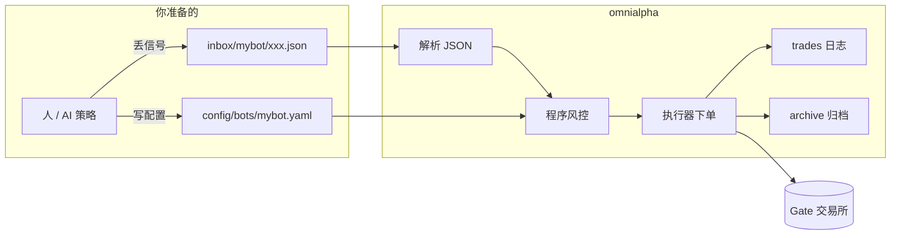
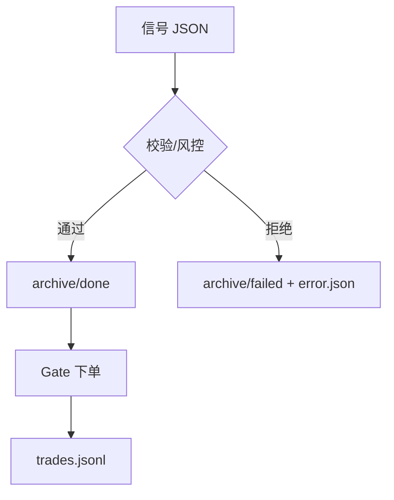

# 10 分钟图文教程：从零跑通第一笔（testnet）

> 目标：配好机器人 → 投一个信号 → 看懂执行结果。  
> 环境：Windows + PowerShell，Python 3.11+（仓库自带 `.venv`）。  
> **先读 [`AGENTS.md`](../AGENTS.md)** 的 8 条铁律，再跟本教程操作。

---

## 0. 系统长什么样



**一句话**：把交易意图写成 JSON 丢进 `inbox/<bot_id>/`，机器人立刻下单（没有 dry-run）。

---

## 1. 准备密钥（模拟盘）

用 **测试网** 密钥，不要一上来就实盘。

```powershell
# 只存在当前终端会话里，不会写进文件
$env:GATE_TESTNET_API_KEY    = "你的测试网Key"
$env:GATE_TESTNET_API_SECRET = "你的测试网Secret"
```

```text
┌─ 安全提示 ─────────────────────────────────────┐
│  · 密钥不要写进 yaml / 贴进聊天 / 进 git        │
│  · API 权限：交易即可，不要给「提币」            │
│  · 实盘请另设 GATE_API_KEY / GATE_API_SECRET    │
└────────────────────────────────────────────────┘
```

---

## 2. 复制一份机器人配置

```powershell
cd <你的仓库目录>    # 例如 /opt/omnialpha 或任意克隆路径
Copy-Item config\bots\_example.yaml config\bots\mybot.yaml
notepad config\bots\mybot.yaml    # Linux 用 vim/nano
```

**只改这 5 处（示意）**：

```yaml
bot_id: mybot              # 与文件名一致即可
enabled: true
env: testnet               # 模拟盘
api_key_env: GATE_TESTNET_API_KEY
api_secret_env: GATE_TESTNET_API_SECRET

symbols:
  - BTC_USDT               # 先只放一个币，好观察

max_notional_usd: 50       # 单笔名义上限，先小
label_prefix: my           # 订单归属前缀 t-my*
require_sl: true           # 开仓必须带止损
order_scope: own           # 只撤自己的单
```

```text
配置字段对应关系（心智图）

  账户维度 ── env / api_key_env
  信号维度 ── inbox/mybot/  + symbols + label_prefix
  安全维度 ── max_notional_usd / require_sl / order_scope
```

---

## 3. 投第一个信号

新建文件 `inbox/mybot/20260101-120000-demo.json`（文件名随意，`.json` 即可）：

```json
{
  "action": "open_long",
  "symbol": "BTC_USDT",
  "size_usd": 20,
  "type": "market",
  "tp": 120000,
  "sl": 60000,
  "label": "demo",
  "meta": {"strategy": "tutorial", "note": "first trade"}
}
```

| 字段 | 含义 | 本例 |
|------|------|------|
| `action` | 开多 / 开空 / 平仓… | `open_long` 开多 |
| `size_usd` | **名义 USDT**（优先用这个） | 20U |
| `type` | `market` / `limit`… | 市价 |
| `tp` / `sl` | 止盈 / 止损触发价 | 按你的风控改合理价位 |
| `label` | 订单标签，便于归属 | `demo` |

> ⚠️ `sl` 在 `require_sl: true` 时**必填**。  
> ⚠️ `size`（张数）与 `size_usd` 不同：各币 1 张名义不一样，优先写 `size_usd`。

更多字段见 **`templates/README.md`**；现成例子见 **`examples/signals/`**。

---

## 4. 执行

```powershell
# 看机器人是否加载正常
.venv\Scripts\python.exe -m omnialpha status

# 只跑一轮：吃掉 inbox 里新文件并下单
.venv\Scripts\python.exe -m omnialpha once --bot mybot
```

```text
终端输出示意

[模拟盘 TESTNET] https://api-testnet.gateapi.io
[done] mybot/20260101-120000-demo.json  ok=True
  entry  confirmed  order_id=...
  tp     confirmed  ...
  sl     confirmed  ...
```

---

## 5. 看结果放哪了

```text
OmniAlpha/
├── inbox/mybot/          ← 空了（文件被吃掉）
├── archive/done/mybot/   ← 成功：原信号 + result.json
├── archive/failed/mybot/ ← 失败：*.error.json（看原因）
└── logs/trades/mybot.jsonl ← 流水日志（可审计）
```

```powershell
# 执行流水
Get-Content logs\trades\mybot.jsonl -Tail 5

# 失败原因（若有）
Get-ChildItem archive\failed\mybot\ | Sort-Object LastWriteTime -Desc
```



---

## 6. 常见失败（对照表）

| error.json 里看到 | 原因 | 怎么改 |
|-------------------|------|--------|
| `SL_REQUIRED` | 开仓没写 `sl` | 补 `"sl": ...` 或临时 `require_sl: false` |
| `size_usd too small` | 名义 < 1 张合约 | 加大 `size_usd` 或换 min_notional 小的币 |
| `symbol ... not in whitelist` | 币不在 `symbols` | 加进配置或改信号 |
| `type=limit requires price` | limit 没写 `price` | 补 `"price": ...` |
| `max_notional_usd` | 超过配置上限 | 降 `size_usd` 或调配置 |
| `invalid JSON` | 文件不是合法 JSON | 检查逗号/引号 |

---

## 7. 用 LLM 策略生成信号（可选）

```powershell
$env:OPENAI_BASE_URL = "http://<你的网关>/v1"
$env:OPENAI_API_KEY  = "..."

# 生成一轮 Plan → 写入 inbox（仍受程序风控）
.venv\Scripts\python.exe -m omnialpha plan --bot mybot

# 策略常驻、执行常驻（两个终端）
.venv\Scripts\python.exe -m omnialpha plan-loop --bot mybot
.venv\Scripts\python.exe -m omnialpha run --bot mybot
```

策略人格在 `prompts/`，配置里 `prompt_file` 指定；改人格见 `prompts/README.md`。

---

## 8. 正式上实盘前

```powershell
# 全量矩阵（只读 + testnet 下单 + 故障）
.venv\Scripts\python.exe scripts\prelaunch_runner.py --phase readonly --env testnet
.venv\Scripts\python.exe scripts\prelaunch_runner.py --phase orders --env testnet

# 小额实单闭环（≤10U，自动 flatten）
.venv\Scripts\python.exe scripts\prelaunch_runner.py --phase live
```

检查清单见 README「上线准备」。**首日 `max_notional_usd` 建议 ≤ 10。**

---

## 9. 你现在会了什么

- [x] 密钥用环境变量  
- [x] 一份 `config/bots/<id>.yaml` = 一个机器人  
- [x] JSON 丢进 `inbox/<id>/` 就会下单  
- [x] 成功看 `archive/done`，失败看 `archive/failed`  
- [x] `size_usd` 优先、必带 `sl`、limit 要 `price`  
- [x] 上线前跑 `prelaunch_runner`  

**下一步**：`examples/signals/` 里换网格、突破、多单例子玩一遍；或按 `prompts/README.md` 写自己的策略人格。

---

## 附录：目录一览图

```text
OmniAlpha/
├── AGENTS.md            ← 总入口（先读）
├── README.md            ← 手册
├── config/bots/mybot.yaml
├── inbox/mybot/         ← 你投信号的地方
├── examples/signals/    ← 12 个可抄例子
├── templates/           ← 字段字典
├── prompts/             ← 策略人格
├── omnialpha/            ← 机器人源码
├── logs/trades/         ← 流水
└── scripts/prelaunch_runner.py
```
