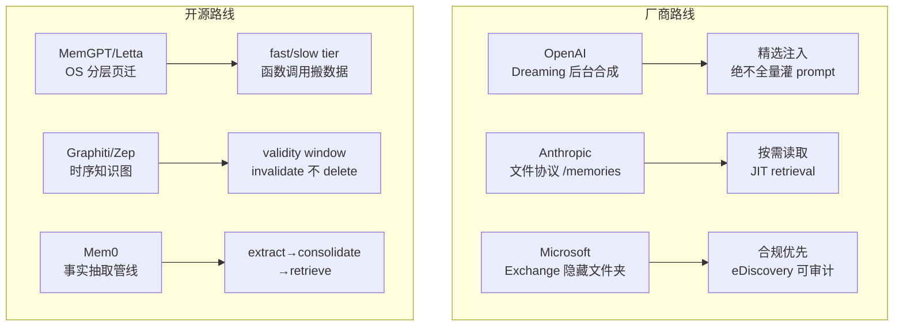

# 交易机器人专属记忆架构 — 深度调研报告

> **日期**: 2026-09-28 | **深度**: deep (8 angles, 102 findings, 25+ sources)
> **问题**: 大厂与开源项目的 agent memory 方案是什么？如何为 7×24 加密交易机器人设计专属记忆架构？

---

## 一、调研总览

| 角度 | 核心发现 | 条数 |
|------|----------|------|
| 厂商架构 | 双通道（saved+inferred）+ 后台合成 + 精选注入，从不全量灌 prompt | 14 |
| 开源框架 | 六大范式：分层页迁 / 状态原语 / 时序图 / 事实抽取 / profile+buffer / KG 平台 | 12 |
| Hermes/OpenClaw | 显式 Markdown 无隐藏状态 + 阶梯式 Dreaming + SQLite 混合检索 | 12 |
| 学术前沿 | 五类认知记忆 + 遗忘是一等公民 + 评测基准揭示 30% 准确率衰减 | 10 |
| 交易系统 | 事件溯源 + 仓位是派生查询 + 决策溯源是监管级要求 | 15 |
| 上下文工程 | KV-cache 命中率是头号指标 + 前缀稳定性是硬约束 | 15 |
| 失败反模式 | 1.2% 毒记忆→准确率 0.85→0.30 + fail-plausible + 修复比预防难 | 12 |
| 多 agent/合规 | 共享记忆是攻击放大面 + 协调协议>模型规模 + 审计记录需代码/模型/数据指纹 | 12 |

---

## 二、市场格局：六种记忆范式



### 2.1 厂商方案核心模式

| 厂商 | 存储 | 注入方式 | 特色 |
|------|------|----------|------|
| **OpenAI** [1][2] | saved memories + chat history inferred | Dreaming V3 后台合成→精选 | 5× 降本；记忆与对话解耦 |
| **Anthropic** [6][7] | 客户端文件 `/memories` | 按需读取（JIT） | 路径隔离 + context editing +39% 准确率 |
| **Microsoft** [10][11] | Exchange 隐藏文件夹 | Graph grounding | eDiscovery 合规路径 |
| **Google** [13] | profile + saved + source insights | 结构化注入 | 连接工作源提取洞察 |

**共性**: 四家都**不把原始对话日志全量灌 prompt**——只注入精选的紧凑记忆切片 [14]。

### 2.2 开源框架六范式

| 框架 | 范式 | 存储 | 检索 | 适用 |
|------|------|------|------|------|
| **MemGPT/Letta** [F2-1,2] | 分层页迁 | MemFS (git-backed) | 函数调用 + heartbeat | 需要 agent 自主管理记忆 |
| **LangGraph** [F2-3,4] | 状态原语 | checkpointer + BaseStore | semantic + filter | 已用 LangGraph 的项目 |
| **Graphiti/Zep** [F2-5,6] | 时序知识图 | Neo4j/FalkorDB | 语义+BM25+图遍历 | 需要时间线推理 |
| **Mem0** [F2-9,10] | 事实抽取 | 向量+图 | 多信号融合 | 对话式记忆 |
| **Memobase** [F2-11] | profile+buffer | SQL | <100ms | 用户画像场景 |
| **Cognee** [F2-12] | KG 平台 | 自托管图 | GLiNER 本地 | 文档/代码记忆 |

### 2.3 你点名的项目

**OpenClaw** [F3-9,10,11] 是最完整的现代 agent 记忆系统：
- **显式 Markdown**：`MEMORY.md`（长期）+ `memory/YYYY-MM-DD.md`（每日）+ `DREAMS.md`（梦境日记），**无隐藏状态**
- **Dreaming 三阶段**：light→REM→deep，六维加权晋升（relevance 0.30 / frequency 0.24 / query-diversity 0.15 / recency 0.15 / integration 0.10 / concept-density 0.06）
- **混合检索**：SQLite FTS5/BM25 + 向量（chunk 400/80）

**Hermes**（Nous Research）[F3-12]：本地 `~/.hermes/` + 自动写 SKILL.md 技能文档。

**Letta dreaming** [F3-8]：后台 subagent 回顾对话→更新 MemFS，`/sleeptime` 触发，可选二审。与 OpenClaw 的 light/REM/deep 是不同实现。

---

## 三、学术前沿关键结论

1. **五类认知记忆**（TMLR 2026 综述 [F4-1]）：sensory / working / episodic / semantic / procedural，不是简单三分

2. **遗忘是一等公民**（Memora [F4-9]）：FAMA 指标惩罚依赖已失效记忆；agent 频繁复用无效记忆是普遍问题

3. **评测基准揭示衰减**（LongMemEval [F4-4]）：商业助手在持续交互中准确率掉 ~30%；五种能力：抽取/跨会话推理/时序推理/知识更新/abstention

4. **rate-distortion 统一视角**（arXiv:2607.08032 [F4-7]）：KV 淘汰/prompt 剪枝/记忆固化都是同一问题——**在 query 未知时不可逆丢弃后续所需信息**

5. **session 级检索优于 turn 级**（MemOps [F4-8]）

---

## 四、交易系统关键结论

1. **仓位是派生查询，不是存储猜测** [F5-2]：从事件/交易库推导，永不漂移

2. **事件溯源是审计骨干** [F5-1,3]：不可变 append-only + 投影重建任意历史时刻

3. **MiFID II RTS 24 / Art. 17** [F5-4,5,7]：监管要求**完整订单生命周期**（不只成交）+ **算法 ID** + **时间序列记录**——决策溯源是合规要求

4. **TradingAgents 的 PortfolioContext** [F5-9]：持仓作为显式 agent 输入（空列表≠无仓位≠不传）

5. **FinPos 的可审计记忆** [F5-11]：决策输出必须**引用记忆索引 ID**，机器可校验

6. **LLM 理由文本不是审计证据** [F5-14]：需要 grounded 工具调用+时间戳+执行日志

---

## 五、上下文工程最佳实践

| 原则 | 依据 | 具体做法 |
|------|------|----------|
| **前缀稳定是硬约束** | Manus [F6-2] | 1 token 差异→全缓存失效；禁止秒级时间戳进 system prompt |
| **KV-cache 命中率是头号指标** | Manus [F6-1] | 输入:输出 ≈ 100:1；缓存价差 10–50× |
| **稳定前缀→动态殿后** | Azure [F6-10] | 官方建议；append-only；确定性序列化 |
| **DeepSeek 磁盘缓存默认开** | DeepSeek [F6-4,6] | 命中 $0.003 vs miss $0.15/MTok（~50×） |
| **compaction + 外部笔记 + 子 agent** | Anthropic [F6-13] | 子 agent 吃数万 token 回传 1–2k |
| **context editing + memory tool** | Anthropic [F6-14] | +39% 准确率，-84% token |

---

## 六、失败反模式（必须规避）

| 反模式 | 量化影响 | 对策 | 依据 |
|--------|----------|------|------|
| **幻觉记忆污染** | 1.2% 毒→准确率 0.85→0.30 | 写时准入门控 | [F7-1,4] |
| **fail-plausible** | 70% 靠人工发现 | 测试覆盖不到→需独立审计 | [F7-3] |
| **防御成本失控** | reranker 误隔离 33.6% | 防御成本>攻击成本时不防 | [F7-5] |
| **记忆膨胀** | 被动全量保留→冗余爆炸 | 语义压缩 30× 省 token | [F7-8] |
| **修复比预防难** | 删源≠清已传播错误 | 依赖引导回滚 | [F7-11] |
| **共享记忆=攻击放大面** | 无防御时 100% 到执行层 | 结构化授权层压至 0% | [F7-7, F8-11] |

---

## 七、交易机器人专属记忆架构设计

### 7.1 设计原则（从调研提炼）

| 原则 | 来源 | 我们的取舍 |
|------|------|-----------|
| 恒定短上下文 | MemGPT [F2-1] + LangGraph [F6-13] | ✅ 每轮 ~4k，不滚全史 |
| 显式无隐藏状态 | OpenClaw [F3-9] | ✅ 所有记忆落盘可审计 |
| 仓位是派生查询 | 事件溯源 [F5-2] | ✅ 从 trades.jsonl 推导 |
| 决策必须引用记忆索引 | FinPos [F5-11] | ✅ Plan JSON 加 `memory_refs` |
| 写时准入门控 | TrustMem [F7-2] | ✅ 记忆写入需一致性校验 |
| 前缀稳定 | Manus [F6-2] | ✅ 固定顺序+殿后变量 |
| 遗忘是一等公民 | Memora [F4-9] | ✅ TTL + 失效标记 |
| 共享记忆隔离 | HARP [F8-11] | ✅ 多人格投票记录不可改 |
| 不做 dreaming/向量 RAG | 项目判定 | ✅ 规则型策略教训在 prompt |

### 7.2 架构总览

```
┌──────────────────── 每轮主上下文（恒定 ~4k）─────────────────────┐
│ 1. system: 策略人格 + 契约 + 工具定义         ~1500t  [缓存全命中] │
│ 2. 订单上下文: 开仓理由/TP-SL/管理记录/投票    0~750t  [部分命中]  │
│ 3. 近 3 轮: decision + reasoning≤30字         ~350t   [结构稳定]  │
│ 4. 本轮快照: 行情/账户/持仓/挂单               ~1500t  [殿后变化]  │
│ 5. 请输出 Plan JSON（含 memory_refs）                             │
└──────────────────────────────────────────────────────────────────┘
         │ 读写
         ▼
┌─ data/shared/orders/<order_id>.json ──────────────────────────────┐
│  共同记忆（multi-persona 已有）                                    │
│  + reason: 开仓理由（T2 新增）                                     │
│  + memory_refs: 决策引用的记忆索引（T2 新增）                      │
│  + lifecycle: [{t, act, detail, by}] 完整生命周期事件（扩展）      │
│  + invalidation: [{field, old, new, t}] 失效标记（新增）          │
└───────────────────────────────────────────────────────────────────┘
         │ 追加（append-only，不可变）
         ▼
┌─ data/bots/<bot>/state/memory_journal.jsonl ──────────────────────┐
│  决策日志（事件溯源）                                              │
│  {ts, cycle_id, plan, snapshot_digest, llm_model, cache_hit,     │
│   memory_refs, executed, exec_result}                             │
│  ← 每轮一条，不可变，可审计（合规级）                              │
└───────────────────────────────────────────────────────────────────┘
         │ 后台批处理（可选，phase 2）
         ▼
┌─ data/bots/<bot>/state/memory_profile.json ───────────────────────┐
│  策略画像（精简持久）                                              │
│  {strategy_params, risk_limits, win_rate, avg_hold, lessons[]}   │
│  ← 非 dreaming，是确定性聚合统计                                   │
└───────────────────────────────────────────────────────────────────┘
```

### 7.3 四层记忆模型（映射学术五类）

| 层 | 对应认知类型 | 载体 | 生命周期 | 进 prompt？ |
|----|-------------|------|----------|------------|
| **Working** | working memory | 当前快照 + 近 3 轮 | 每轮重建 | ✅ 每轮 |
| **Order** | episodic (近) | `shared/orders/<id>.json` | 开仓→平仓 | ✅ 持仓期 |
| **Journal** | episodic (全) | `memory_journal.jsonl` | 永久 append-only | ❌ 只读近 3 轮摘要 |
| **Profile** | semantic + procedural | `memory_profile.json` + prompt | 跨订单持久 | ✅ 精简后进 system |

### 7.4 订单生命周期记忆（核心创新）

```json
{
  "order_id": "o-abc123",
  "symbol": "BTC_USDT", "side": "long",
  "opened_at": "2026-09-28T10:00:00Z",
  "entry_price": 84000, "size_usd": 300,
  "tp": 85700, "sl": 83500,
  "reason": "突破24h高点追多，止损放近期结构下方",
  "memory_refs": ["journal:c-042", "journal:c-038"],
  "votes": {"c-042": {"brooks": {"decision": "long", "conf": 0.85, "reasoning": "趋势延续"}}},
  "lifecycle": [
    {"t": "...", "act": "open", "detail": "entry=84000", "by": "fusion:weighted_vote"},
    {"t": "...", "act": "modify_tp", "detail": "tp→86000", "by": "brooks"},
    {"t": "...", "act": "reduce", "detail": "1R减半", "by": "fusion:consensus"}
  ],
  "invalidation": [],
  "status": "open"
}
```

**关键改进**（vs 原 spec）：
1. `reason` — 开仓理由常驻 prompt，平仓后保留可审计
2. `memory_refs` — 决策引用的历史决策索引（FinPos 模式），机器可校验
3. `lifecycle` — 完整管理事件（不只是 log，含操作者 `by`），对标 MiFID II
4. `invalidation` — 失效标记（如市场结构变化使原止损假设失效），对标 Memora FAMA

### 7.5 决策日志（事件溯源）

每轮追加到 `memory_journal.jsonl`（append-only，不可变）：

```json
{
  "ts": "2026-09-28T10:15:00Z",
  "cycle_id": "c-042",
  "decision": "long",
  "reasoning": "突破24h高点...",
  "memory_refs": ["journal:c-038"],
  "snapshot_digest": "sha256:abc...",
  "llm_model": "deepseek-flash",
  "prompt_cache_hit_tokens": 1850,
  "executed": true,
  "exec_result": {"order_id": "o-abc123", "filled": 84000}
}
```

**好处**：
- 合规级审计（MiFID II 要求的时间序列记录 + 算法 ID）
- 崩溃恢复（重放事件→重建任意时刻状态）
- 近 3 轮摘要直接从这里读
- 缓存命中率监控（`prompt_cache_hit_tokens`）

### 7.6 上下文组装规则（缓存优化）

```
固定前缀（缓存命中区，~1850t）:
  1. system prompt（策略人格+契约）     ← 逐字稳定
  2. 工具定义                           ← 顺序固定
  3. 订单上下文模板框架                 ← 结构稳定
  4. 近 3 轮格式框架                    ← 结构稳定

动态后缀（缓存未命中区，~1850t）:
  5. 订单上下文具体值                   ← 变化值
  6. 近 3 轮具体内容                    ← 变化值
  7. 本轮快照                           ← 全变化
```

**规则**（从 Manus/Azure/DeepSeek 提炼）：
- 禁止秒级时间戳进 system prompt 开头
- JSON 序列化确定性（固定 key 顺序）
- 不在迭代中途增删工具
- 每轮记录 `prompt_cache_hit_tokens` 作为健康指标

### 7.7 遗忘与失效策略

| 机制 | 触发 | 行为 | 依据 |
|------|------|------|------|
| **订单生命周期** | 平仓 | 移出 prompt，保留文件 | 自然边界 |
| **近 3 轮滑窗** | 每轮 | 只留最近 3 条摘要 | MemOps session 级 |
| **TTL** | 90 天 | journal 归档到 `.gz` | Microsoft 28 天 TTL 参考 |
| **失效标记** | 市场结构变化 | `invalidation` 标记旧假设失效 | Memora FAMA |
| **profile 聚合** | 平仓后 | 确定性统计更新（非 LLM） | Memobase buffer 批处理 |

### 7.8 未来扩展路径

| 阶段 | 能力 | 架构预留 |
|------|------|----------|
| **Phase 1**（当前） | 单 bot 订单记忆 + 决策日志 | 订单上下文 + journal |
| **Phase 2** | 多 bot 共管共同记忆 | `shared/orders/` 已有，加投票审计 |
| **Phase 3** | 组合级记忆 | `data/shared/portfolio.json`（跨 bot 汇总） |
| **Phase 4** | 策略画像 + 跨策略学习 | `memory_profile.json` 确定性聚合 |
| **Phase 5** | 合规审计导出 | journal→MiFID II RTS 24 格式 |

**明确不做**（长期保持）：
- ❌ Dreaming / LLM 后台固化（规则型策略教训在 prompt，过拟合风险）
- ❌ 向量 RAG 记忆库（窗口小，收益不抵成本）
- ❌ 全量历史滚动 messages（超窗/贵/分心/伤缓存）
- ❌ 跨策略 embedding 迁移（KTD-Fin 证明记忆泄漏会污染评估）

---

## 八、与现有系统的对接

| 现有资产 | 记忆架构角色 | 改动量 |
|----------|-------------|--------|
| `data/shared/orders/` | Order 层载体 | 加 `reason`/`memory_refs`/`lifecycle`/`invalidation` 字段 |
| `logs/trades/*.jsonl` | 喂给 Journal 层 | 不改，由 T2 挂钩写入 journal |
| `state/*.thinking.json` | 可选审计附件 | 不改，journal 引用其路径 |
| `PlanRunner.analyze_once` | 输出加 `memory_refs` | 小改 |
| persona fusion | 投票进 `votes` | 已有，加 `by` 标记 |
| DeepSeek `prompt_cache_hit_tokens` | 缓存健康监控 | T6 加日志 |

---

## 九、成本预估

| 层 | token/轮 | 缓存 | 月成本（96 轮/天） |
|----|----------|------|-------------------|
| system+人格 | ~1500 | 全命中 $0.003/1M | ~$0.01 |
| 订单上下文 | 0~750 | 部分命中 | ~$0.05 |
| 近 3 轮 | ~350 | 结构稳定 | ~$0.02 |
| 快照 | ~1500 | 未命中 $0.15/1M | ~$0.65 |
| **合计** | **~4k** | | **~$0.73/月/bot** |

对比全量历史（1000 轮 × 3k = 3M token/轮）：**省 99%+**。

---

## 十、Open Questions

1. **Hermes `~/.hermes/` 具体 schema** — GitHub 抓取失败，未从源码核实
2. **FINRA/SEC 原始监管通告** — arXiv 覆盖不到，合规细节需补
3. **DeepSeek 缓存续期策略** — 15 分钟一轮是否足够保持磁盘缓存命中？需实测
4. **记忆评估基准的可靠性** — token-F1 vs LLM-as-judge 差 27.5 分 [F7 suggested]，自评指标需谨慎

---

## Sources

### 厂商文档
[1] https://openai.com/index/memory-and-new-controls-for-chatgpt/ (2025-04-10)
[2] https://openai.com/index/chatgpt-memory-dreaming/ (2026-06-04)
[6] https://platform.claude.com/docs/en/agents-and-tools/tool-use/memory-tool
[7] https://claude.com/blog/context-management (2025-09-29)
[10] https://learn.microsoft.com/en-us/microsoft-365/copilot/copilot-personalization-memory (2026-09-02)
[13] https://docs.cloud.google.com/gemini/enterprise/docs/configure-personalization

### 开源项目
[F2-1] https://arxiv.org/abs/2310.08560 (MemGPT)
[F2-2] https://github.com/letta-ai/letta
[F2-3] https://docs.langchain.com/oss/python/langgraph/memory
[F2-5] https://github.com/getzep/graphiti
[F2-9] https://arxiv.org/abs/2504.19413 (Mem0)
[F2-11] https://github.com/memodb-io/memobase
[F3-8] https://docs.letta.com/configuration/memory
[F3-9] https://docs.openclaw.ai/zh-CN/concepts/memory
[F3-10] https://docs.openclaw.ai/zh-CN/concepts/dreaming
[F3-11] https://docs.openclaw.ai/zh-CN/concepts/memory-builtin
[F3-12] https://hermes-agent.org/zh/ (medium confidence)

### 学术论文
[F4-1] https://arxiv.org/abs/2602.06052 (TMLR 2026 survey)
[F4-4] https://arxiv.org/abs/2410.10813 (LongMemEval, ICLR 2025)
[F4-6] https://arxiv.org/abs/2402.17753 (LoCoMo)
[F4-7] https://arxiv.org/abs/2607.08032 (rate-distortion)
[F4-8] https://arxiv.org/abs/2607.12893 (MemOps)
[F4-9] https://arxiv.org/abs/2604.20006 (Memora FAMA)

### 交易系统
[F5-4] https://reg-x.co.uk/blogs/mifid-ii-rts-24-annex-iv-order-execution-record-keeping/
[F5-7] https://www.esma.europa.eu/publications-and-data/interactive-single-rulebook/mifid-ii/article-17-algorithmic-trading
[F5-8] https://raw.githubusercontent.com/TauricResearch/TradingAgents/main/README.md
[F5-10] https://arxiv.org/html/2510.27251v1 (FinPos)
[F5-12] https://arxiv.org/html/2605.28359v1 (KTD-Fin)
[F5-14] https://arxiv.org/html/2605.19337v1 (Agentic Trading survey)

### 上下文工程
[F6-1] https://manus.im/blog/Context-Engineering-for-AI-Agents-Lessons-from-Building-Manus
[F6-4] https://api-docs.deepseek.com/guides/kv_cache
[F6-6] https://api-docs.deepseek.com/quick_start/pricing
[F6-8] https://learn.microsoft.com/en-us/azure/ai-foundry/openai/how-to/prompt-caching
[F6-12] https://www.anthropic.com/engineering/effective-context-engineering-for-ai-agents

### 失败案例
[F7-1] https://arxiv.org/abs/2607.22962 (memory contamination)
[F7-3] https://arxiv.org/abs/2606.14589 (fail-plausible)
[F7-4] https://arxiv.org/abs/2608.21230 (poisoning)
[F7-7] https://arxiv.org/abs/2609.17648 (shared memory attack)

### 多 agent / 合规
[F8-3] https://arxiv.org/abs/2407.06567 (FinCon)
[F8-4] https://arxiv.org/abs/2606.01886 (InKH)
[F8-9] https://arxiv.org/abs/2607.07359 (UK regulation)
[F8-11] https://arxiv.org/abs/2605.27489 (HARP)

---

*报告由 deep-research 流程生成：8 个独立 sub-agent 并行调研，102 条 sourced findings，覆盖 2023–2026 一手来源。*
